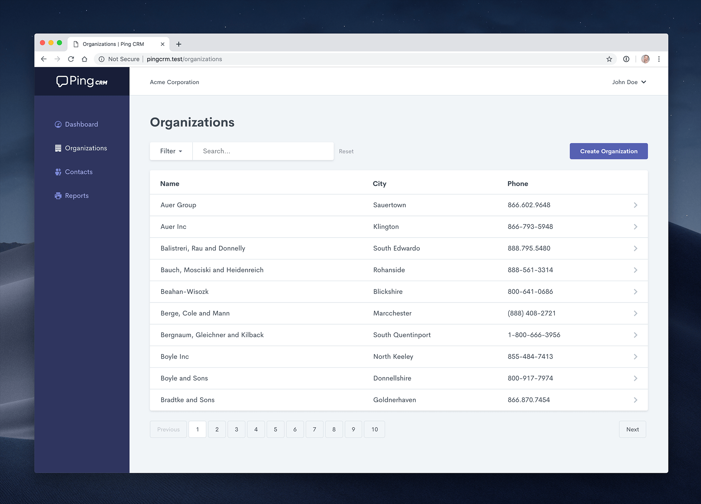

# inertia-ping-crm

> PingCRM by Inertia (`Laravel` + `Vue`)

A CRM application built with [Inertia.js](https://inertiajs.com/)



## Prerequisites

```yaml
php: 8.2.12
composer: 2.7.9

node.js: 18.20.7
npm: 10.8.2
```

## Getting Started

Install PHP dependencies:

```bash
$ composer install
```

Install NPM dependencies:

```bash
$ npm ci
```

Build assets:

```bash
$ npm run dev

# !!!
$ npm run build
```

Setup configuration:

```bash
$ cp .env.example .env
```

Generate Laravel application key:

```bash
$ php artisan key:generate
```

Create a MySQL database.

    You can also use another database (SQLite, Postgres). Simply update your configuration accordingly.

- Clarify MySQL database info in `.env` file:

```yaml
...
DB_CONNECTION=mysql
DB_HOST=127.0.0.1
DB_PORT=3306
DB_DATABASE=pingcrm
DB_USERNAME=root
DB_PASSWORD=
...
```

- Clarify MySQL database connection in `phpunit.xml` file:

```xml
<env name="DB_CONNECTION" value="mysql"/>
```

Run database migrations:

```bash
$ php artisan migrate
```

Run database seeder:

```bash
$ php artisan db:seed
```

Run the dev server (the output will give the address):

```bash
$ php artisan serve
```

You're ready to go! Visit [Ping CRM](http://localhost:8000) in your browser, and login with:

- **Username:** johndoe@example.com
- **Password:** secret

## Running tests

To run the Ping CRM tests, run:

```bash
$ phpunit
```

&copy; 2025 All Rights Reserved.
